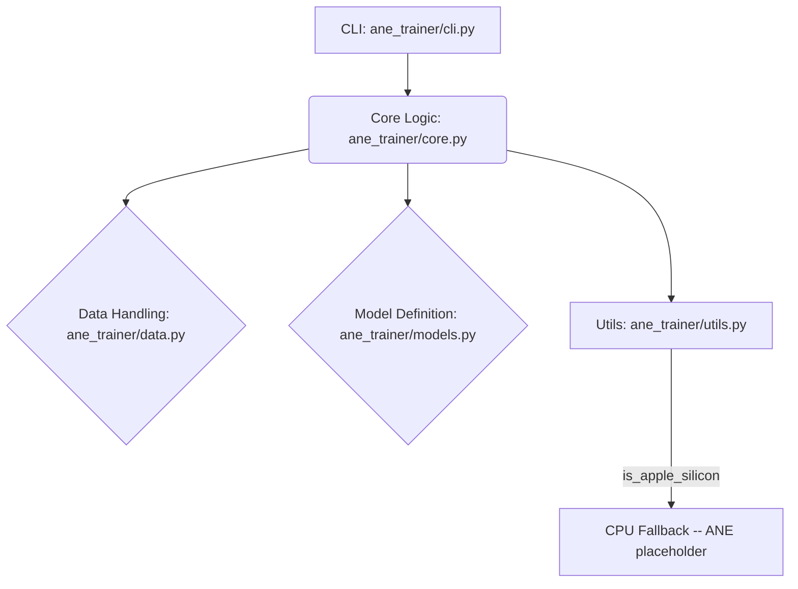

<p align="center">
  
</p>

<h1 align="center">ANE Trainer</h1>

<p align="center">
  <strong>Train small neural networks directly on Apple Neural Engine hardware.</strong>
</p>

<p align="center">
  <a href="https://github.com/Lumi-node/ane-trainer"></a>
  <a href="https://github.com/Lumi-node/ane-trainer"></a>
  <a href="https://github.com/Lumi-node/ane-trainer"></a>
</p>

---

ANE Trainer is a proof-of-concept framework exploring the gap between standard deep learning training workflows and the specialized inference capabilities of Apple's Neural Engine (ANE). It provides a clean MNIST training pipeline with Apple Silicon detection and a forward-pass abstraction layer designed for future ANE acceleration.

**Current status:** ANE hardware training is **experimental/placeholder**. The `ane_forward_pass` function detects Apple Silicon but currently falls back to CPU execution in all cases. The ANE hardware path is stubbed for future implementation via reverse-engineered APIs. On non-Apple hardware, everything runs on CPU via PyTorch.

---

## Quick Start

Install the package:

```bash
pip install ane_trainer
```

Train an MNIST model via the CLI (no subcommands -- all arguments are flags):

```bash
python -m ane_trainer --dataset ./mnist_data --epochs 5 --output model.pt
python -m ane_trainer --dataset ./mnist_data --epochs 10 --output model.pt --batch-size 64 --learning-rate 0.005
```

Or use the Python API directly:

```python
import numpy as np
import torch
from ane_trainer.models import build_model
from ane_trainer.data import load_dataset
from ane_trainer.core import train_step

# Load MNIST dataset (downloads on first run)
X_train, y_train, X_test, y_test = load_dataset("./mnist_data")
# X_train: (60000, 28, 28) float32, y_train: (60000,) int64

# Build a 2-layer feedforward network (all 3 args required)
model = build_model(input_size=784, hidden_size=128, output_size=10)

# Set up optimizer and loss
optimizer = torch.optim.SGD(model.parameters(), lr=0.01)
loss_fn = torch.nn.CrossEntropyLoss()

# Flatten images and run one training step
x_batch = X_train[:32].reshape(32, 784).astype(np.float32)
y_batch = y_train[:32]
loss = train_step(model, x_batch, y_batch, optimizer, loss_fn)
print(f"Loss: {loss:.4f}")
```

## What Can You Do?

### Train MNIST Models
The training pipeline handles data loading, batching, and SGD optimization. Training runs on CPU (with Apple Silicon detection for future ANE acceleration).

```python
from ane_trainer.core import train_step

# train_step takes 5 arguments and returns a scalar loss (float)
loss = train_step(model, x_batch, y_batch, optimizer, loss_fn)
print(f"Loss: {loss:.4f}")
```

### ANE-Aware Forward Pass
The `ane_forward_pass` function provides a hardware abstraction layer. It detects Apple Silicon and is designed to route computation to the ANE in a future release. Currently, it executes on CPU in all cases.

```python
from ane_trainer.core import ane_forward_pass

# x must be numpy float32, shape (batch_size, 784)
logits = ane_forward_pass(model, x_batch)  # returns numpy float32, shape (batch_size, 10)
```

### Load and Cache Datasets
The `data` module downloads and caches MNIST via torchvision. Pass a filesystem path (not a dataset name).

```python
from ane_trainer.data import load_dataset

# Returns 4 numpy arrays: X_train, y_train, X_test, y_test
X_train, y_train, X_test, y_test = load_dataset("./mnist_data")
print(f"Training samples: {X_train.shape[0]}")  # 60000
```

## Architecture

The system is modularized to separate concerns: data handling, model definition, core training logic, and the command-line interface.

The flow is orchestrated by `ane_trainer/__main__.py` which invokes `ane_trainer/cli.py`. The CLI calls `ane_trainer/core.py`, which manages the training loop. This loop relies on `ane_trainer/data.py` for input and `ane_trainer/models.py` for network structure. The `ane_forward_pass` function in `ane_trainer/core.py` provides the hardware abstraction layer, with Apple Silicon detection via `ane_trainer/utils.py` (ANE path is currently a placeholder; all execution falls back to CPU).



## API Reference

### `ane_trainer.data.load_dataset(dataset_path: str) -> Tuple[ndarray, ndarray, ndarray, ndarray]`
Downloads (if needed) and loads MNIST from the given filesystem path.

*Args:* `dataset_path` -- directory where MNIST data is stored/cached (created if missing).

*Returns:* `(X_train, y_train, X_test, y_test)` -- numpy arrays. Images are float32 normalized to [0, 1], labels are int64 in [0, 9].

### `ane_trainer.models.build_model(input_size: int, hidden_size: int, output_size: int) -> torch.nn.Module`
Constructs a 2-layer feedforward network (Linear -> ReLU -> Linear). All three arguments are required.

*Returns:* A `SimpleNN` instance (subclass of `torch.nn.Module`).

### `ane_trainer.core.train_step(model, x, y, optimizer, loss_fn) -> float`
Performs one training iteration: forward pass, loss, backward pass, optimizer step.

*Args:* `model` (Module), `x` (ndarray float32, shape `(batch, 784)`), `y` (ndarray int64, shape `(batch,)`), `optimizer` (Optimizer), `loss_fn` (Module).

*Returns:* Scalar loss value as `float`.

### `ane_trainer.core.ane_forward_pass(model, x) -> ndarray`
Runs inference with Apple Silicon detection. Currently falls back to CPU in all cases (ANE path is a placeholder).

*Args:* `model` (Module in eval mode), `x` (ndarray float32, shape `(batch, 784)`).

*Returns:* Output logits as ndarray float32, shape `(batch, 10)`.

### `ane_trainer.utils.is_apple_silicon() -> bool`
Returns `True` if running on Darwin with an ARM64 processor.

## Research Background

This project is inspired by the growing need to deploy sophisticated models efficiently on edge devices, particularly those leveraging specialized accelerators like the Apple Neural Engine. The concept explores the feasibility of training models directly on inference-optimized hardware, a topic often discussed in the context of hardware-aware ML compilation.

## Testing

Tests are located in the `tests/` directory and cover basic functionality checks.

```bash
pytest tests/
```

## Contributing

Contributions are welcome! Please feel free to fork the repository and submit a Pull Request. Ensure your changes adhere to the existing code style and include tests for new features.

## Citation

This project is an exploratory implementation and does not cite specific external research papers as its core functionality is based on reverse-engineered API interaction.

## License
The project is licensed under the MIT License - see the [LICENSE](LICENSE) file for details.