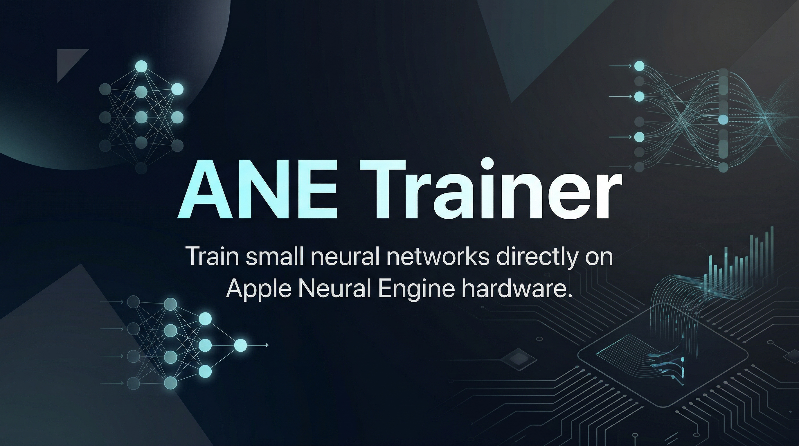
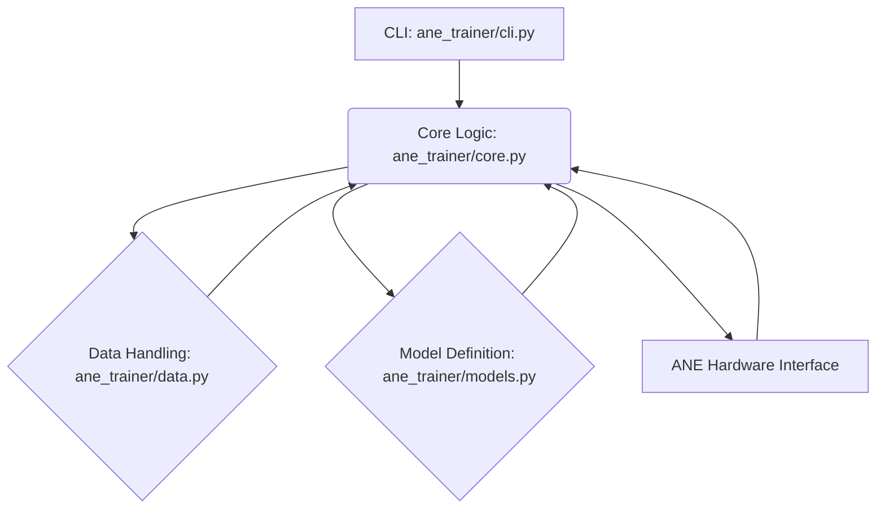

<p align="center">
  
</p>

<h1 align="center">ANE Trainer</h1>

<p align="center">
  <strong>Train small neural networks directly on Apple Neural Engine hardware.</strong>
</p>

<p align="center">
  <a href="https://github.com/Lumi-node/ane-trainer"></a>
  <a href="https://github.com/Lumi-node/ane-trainer"></a>
  <a href="https://github.com/Lumi-node/ane-trainer"></a>
</p>

---

ANE Trainer is a proof-of-concept framework designed to bridge the gap between standard deep learning training workflows and the specialized inference capabilities of Apple's Neural Engine (ANE). It aims to allow developers to train lightweight neural networks directly targeting ANE hardware, circumventing the typical inference-only use case.

This project serves as an exploration into reverse-engineering and utilizing low-level ANE APIs within a high-level Python environment. While currently a skeleton, it demonstrates the architectural approach required to orchestrate data loading, model definition, and hardware-accelerated training loops.

---

## Quick Start

First, install the package:

```bash
pip install ane_trainer
```

To run the training pipeline using the CLI:

```bash
ane_trainer train --dataset mnist --epochs 5
```

A basic usage example demonstrating model definition and data loading:

```python
from ane_trainer.models import build_model
from ane_trainer.data import load_dataset

# Load MNIST dataset
dataset = load_dataset('mnist')

# Build a simple 3-layer network
model = build_model(input_size=784, output_size=10)

print("Model built successfully.")
```

## What Can You Do?

### Train on ANE Hardware
The core functionality allows the training process to be orchestrated to leverage the ANE for forward and backward passes, simulating a full training loop on specialized hardware.

```python
from ane_trainer.core import train_step

# Assuming model and data are loaded
loss, metrics = train_step(model, data_batch)
print(f"Loss: {loss:.4f}")
```

### Define and Load Datasets
The `data` module provides utilities to fetch and preprocess standard datasets like MNIST, preparing them for the ANE pipeline.

```python
from ane_trainer.data import load_dataset
mnist_data = load_dataset('mnist')
print(f"Dataset loaded with {len(mnist_data)} samples.")
```

## Architecture

The system is modularized to separate concerns: data handling, model definition, core training logic, and the command-line interface.

The flow is orchestrated by `ane_trainer/__main__.py` which invokes `ane_trainer/cli.py`. The CLI calls `ane_trainer/core.py`, which manages the training loop. This loop relies on `ane_trainer/data.py` for input and `ane_trainer/models.py` for network structure. The critical hardware interaction happens within `ane_trainer/core.py` via the `ane_forward_pass` function, which interfaces with the underlying ANE APIs.



## API Reference

### `ane_trainer.data.load_dataset(name: str)`
Fetches and prepares the specified dataset (e.g., 'mnist').

*Returns:* A data loader object.

### `ane_trainer.models.build_model(input_size: int, output_size: int)`
Constructs a standard, trainable neural network structure.

*Returns:* A PyTorch/TorchVision compatible model instance.

### `ane_trainer.core.ane_forward_pass(model, input_tensor)`
Executes the forward pass of the model specifically targeting the ANE hardware path.

*Returns:* The output tensor from the ANE execution.

## Research Background

This project is inspired by the growing need to deploy sophisticated models efficiently on edge devices, particularly those leveraging specialized accelerators like the Apple Neural Engine. The concept explores the feasibility of training models directly on inference-optimized hardware, a topic often discussed in the context of hardware-aware ML compilation.

## Testing

Tests are located in the `tests/` directory and cover basic functionality checks.

```bash
pytest tests/
```

## Contributing

Contributions are welcome! Please feel free to fork the repository and submit a Pull Request. Ensure your changes adhere to the existing code style and include tests for new features.

## Citation

This project is an exploratory implementation and does not cite specific external research papers as its core functionality is based on reverse-engineered API interaction.

## License
The project is licensed under the MIT License - see the [LICENSE](LICENSE) file for details.