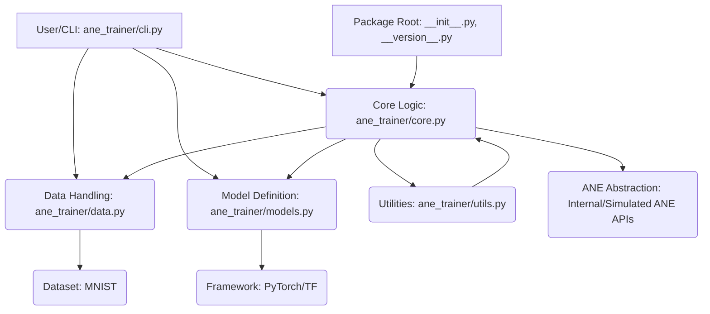

# ANE Trainer Architecture

## 🚀 System Overview

`ane_trainer` is a specialized Python package designed to streamline the process of training small neural networks specifically targeting acceleration on Apple Neural Engine (ANE) hardware. It acts as a high-level orchestration layer, abstracting away the complexities of low-level ANE API interactions. The tool allows users to define a standard model (e.g., using PyTorch or TensorFlow), load a simple dataset (like MNIST), and execute the training loop, with the core logic handling the necessary transformations and calls required to leverage ANE capabilities for efficient inference and training simulation/execution.

## 🧩 Module Relationships

The following diagram illustrates how the various components of the `ane_trainer` package interact to achieve the training pipeline.

## 📚 Module Descriptions

| Module | Role | Description |
| :--- | :--- | :--- |
| `ane_trainer/__init__.py` | Package Initialization | Defines the package structure and makes core components importable at the top level. |
| `ane_trainer/__main__.py` | Entry Point Runner | Provides the standard Python entry point (`python -m ane_trainer`) for running the application, often delegating to `cli.py`. |
| `ane_trainer/__version__.py` | Version Control | Stores and exposes the current version number of the `ane_trainer` package. |
| `ane_trainer/cli.py` | Command Line Interface | The primary user interface. It parses command-line arguments (e.g., dataset choice, epochs) and initiates the training workflow by calling functions in `core.py`. |
| `ane_trainer/core.py` | Orchestration Engine | The heart of the application. It manages the overall training lifecycle: loading data, building the model, running the training loop, and interfacing with the ANE abstraction layer. |
| `ane_trainer/data.py` | Data Management | Responsible for fetching, preprocessing, and batching datasets. Contains the `load_dataset()` function, specifically handling MNIST loading and transformation. |
| `ane_trainer/models.py` | Model Definition | Contains the definitions for the neural network architectures. Implements the `build_model()` function, defining the 2-3 layer network structure using the chosen framework. |
| `ane_trainer/utils.py` | Helper Functions | Houses general utility functions, such as logging setup, metric calculation helpers, and potentially device management wrappers. |
| `example.py` | Demonstration Script | A standalone script provided for quick testing and demonstration of how to use the package outside the CLI structure. |
| `tests/__init__.py` | Testing Suite | Initializes the testing environment, containing unit and integration tests for the core components. |

## 🌊 Data Flow Explanation

The training process follows a clear, sequential data flow orchestrated by `ane_trainer/core.py`:

1. **Initialization (CLI $\rightarrow$ Core):** The user invokes the tool via `ane_trainer/cli.py`, passing configuration parameters (e.g., `--dataset mnist`). `cli.py` passes these parameters to `core.py`.
2. **Data Loading (Core $\rightarrow$ Data):** `core.py` calls `ane_trainer/data.py:load_dataset()`. This function fetches the raw MNIST data, performs necessary normalization, and returns iterable data loaders (batches).
3. **Model Construction (Core $\rightarrow$ Models):** Simultaneously or subsequently, `core.py` calls `ane_trainer/models.py:build_model()`. This function constructs the defined neural network structure (e.g., a simple MLP) using the underlying framework (PyTorch/TF).
4. **Training Loop Execution (Core $\leftrightarrow$ Data/Models):**
    * The `core.py` training loop iterates over the batches provided by the data loaders.
    * For each batch, the data is passed through the model defined in `models.py`.
    * The forward pass results are used to calculate loss (using helpers from `utils.py`).
    * The backward pass and optimization steps occur.
5. **ANE Integration (Core $\rightarrow$ ANE Abstraction):** Crucially, during the training or inference steps within the loop, `core.py` interacts with the simulated or reverse-engineered ANE APIs (represented conceptually). This layer handles the necessary quantization, compilation, or dispatching of operations to target the ANE hardware efficiently.
6. **Result Reporting (Core $\rightarrow$ CLI):** After the epochs complete, `core.py` aggregates metrics and returns the final results back to `cli.py`, which prints a summary to the user.